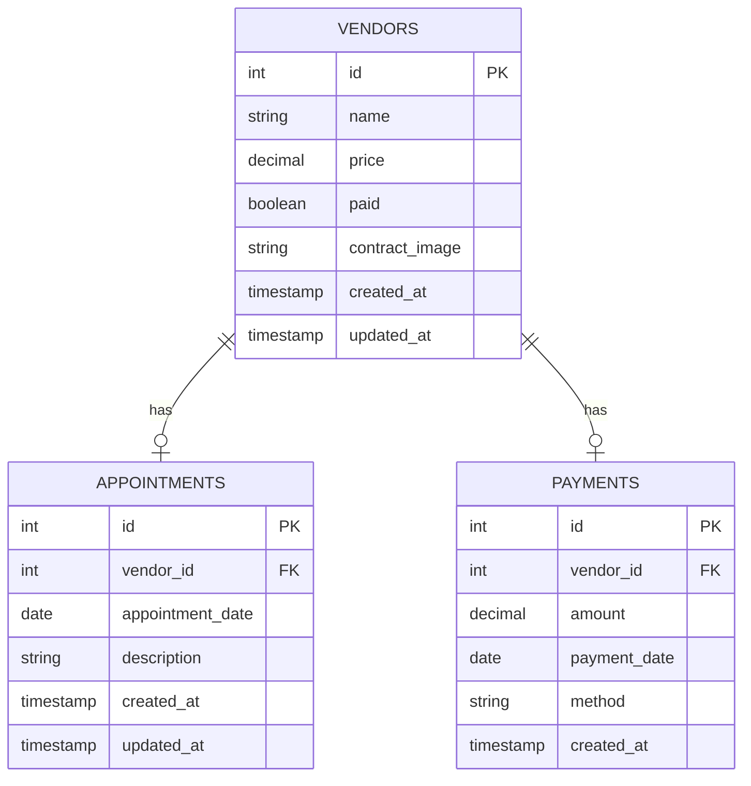

```mermaid
erDiagram
    VENDORS {
        int id PK
        string name
        decimal price
        boolean paid
        string contract_image
        timestamp created_at
        timestamp updated_at
    }

    APPOINTMENTS {
        int id PK
        int vendor_id FK
        date appointment_date
        string description
        timestamp created_at
        timestamp updated_at
    }

    PAYMENTS {
        int id PK
        int vendor_id FK
        decimal amount
        date payment_date
        string method
        timestamp created_at
    }

    VENDORS ||--o| APPOINTMENTS : has
    VENDORS ||--o| PAYMENTS : has
```